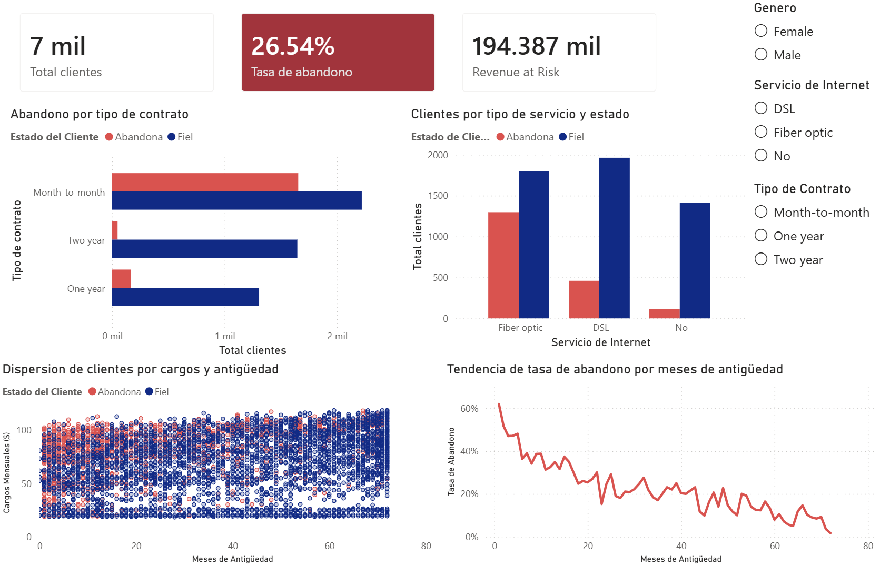
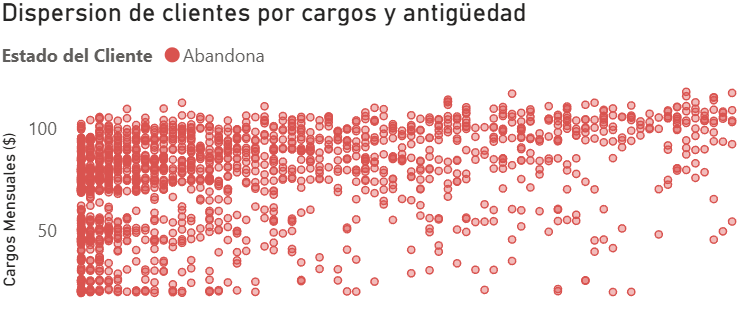

# SaaS Customer Churn Analysis / Análisis de Retención de Clientes SaaS

📌 [Read in English](#english-version) | 📌 [Leer en Español](#version-en-español)

---

## 🇺🇸 English Version

### 📄 Project Overview
This end-to-end data analysis project focuses on identifying the root causes of customer churn for a SaaS company. The ultimate goal is to provide actionable insights to optimize customer retention, safeguard monthly recurring revenue (MRR), and decrease churn using a data-driven approach that combines data engineering, statistical validation, and visual storytelling.

### 🛠️ Tech Stack & Skills Demonstrated
* **Python (Pandas, SciPy, Seaborn):** Data cleaning, deep exploratory data analysis (EDA), Feature Engineering (ARPU creation), and Statistical Hypothesis Testing ($T\text{-Test}$).
* **SQL (PostgreSQL):** Database schema creation (DDL), data ingestion, and advanced querying using **CTEs** and **Window Functions** (`RANK()`). Built database views to serve as a clean semantic layer.
* **Power BI:** Data modeling, star schema design, and executive dashboard creation using advanced **DAX** metrics.

### 📁 Repository Structure
* **`/notebooks`**: Data ingestion, deep cleaning, feature engineering, and statistical hypothesis testing ($T\text{-Test}$) using Python.
* **`/sql`**: Data Definition Language (DDL), advanced analytical queries with window functions, and semantic layer creation using PostgreSQL views.
* **`/dashboard`**: Core `.pbix` Power BI source file and high-resolution executive report screenshots.

---

### 📊 Results Visualization & Key Findings

#### 1. Central Executive Dashboard
An interactive dashboard was designed and optimized to monitor the **Churn Rate (currently at 26.54%)** and Revenue at Risk. The user interface adheres to strict visual hierarchy and cohesive color encoding (Red/Rust for churn alerts and Navy Blue for retained customers).

#### 2. Temporal Behavior & Master Insight
By plotting and analyzing data through a dynamic line chart, a critical pattern was discovered: **churn risk is heavily concentrated within the customer's first months of tenure** (reaching peaks above 60% in Month 1) and stabilizes significantly after the second year.

---

### 💡 Technical & Statistical Insights

1. **Hypothesis Testing**: Using an independent $T\text{-Test}$ in Python, the null hypothesis was rejected, statistically confirming ($p < 0.05$) that customers who churn face significantly higher monthly charges than loyal customers.
2. **Query Optimization**: Implemented window functions (`RANK() OVER(...)`) in PostgreSQL to segment and identify the top high-cost customers per contract type, enabling targeted commercial actions.
3. **Abstraction Layer**: Built a SQL view (`v_reporte_churn_bi`) acting as a clean semantic layer for Power BI, removing the need for heavy data transformations inside the `.pbix` file.

---

### 👔 Business Recommendations

By cross-referencing insights from all tools, three high-priority strategies were defined for the *Customer Success* team:

1. **Priority Retention Plan for Month-to-Month Contracts:**
   * **Finding:** Month-to-month contracts account for 80% of total churn.
   * **Strategy:** Launch an automated migration campaign to annual plans by offering a 15% discount during the first quarter. Retaining an active customer is drastically more cost-effective than New Customer Acquisition Cost (CAC).

2. **Fiber Optic Service Quality Audit:**
   * **Finding:** Customers using Fiber Optic internet show a 42% higher churn rate, showing abnormally high drop-offs during their first 6 months.
   * **Strategy:** Audit the initial installation and provisioning processes for fiber optic services. Implement a mandatory post-sale satisfaction protocol (*Check-in*) 30 days after onboarding.

3. **Bundle Technical Support into Premium Packages:**
   * **Finding:** Customers lacking technical support (*Tech Support*) are nearly 3 times more likely to churn upon their first service issue.
   * **Strategy:** Subsidize or natively include basic technical support in premium internet packages to increase customer switching costs and build loyalty.

---

### 📥 How to Interact with this Project
1. To explore database scripts, navigate to the `/sql` folder.
2. To review statistical tests or replicate the data cleaning process, open the Jupyter Notebook in `/notebooks`.
3. If you have Power BI Desktop installed, you can **[download the interactive .pbix file here](Dashboard_Churn.pbix)**.

---

## 🇪🇸 Versión en Español

### 📄 Descripción del Proyecto
Este proyecto presenta un ecosistema analítico integral (End-to-End) diseñado para identificar las causas raíz de la deserción de clientes (*Churn*) en una empresa SaaS. El objetivo final es proporcionar insights accionables para optimizar la retención de clientes, proteger el ingreso recurrente mensual (MRR) y disminuir la pérdida de clientes mediante un enfoque metodológico que combina ingeniería de datos, validación estadística y storytelling visual.

### 🛠️ Tecnologías y Habilidades Demostradas
* **Python (Pandas, SciPy, Seaborn):** Ingesta de datos, limpieza profunda, análisis exploratorio de datos (EDA), *Feature Engineering* (creación de métricas como ARPU) y validación de hipótesis estadísticas ($T\text{-Test}$).
* **SQL (PostgreSQL):** Definición de estructura de base de datos (DDL), consultas avanzadas utilizando **CTEs** y **Window Functions** (`RANK()`). Creación de vistas como capa semántica limpia.
* **Power BI:** Modelado de datos (esquema en estrella) y diseño de reportes ejecutivos interactivos utilizando métricas avanzadas en **DAX**.

### 📁 Estructura del Repositorio
* **`/notebooks`**: Ingesta, limpieza profunda, ingeniería de variables y validación de hipótesis ($T\text{-Test}$) en Python.
* **`/sql`**: Definición de estructura (DDL), consultas avanzadas analíticas con funciones de ventana y creación de la capa semántica mediante vistas en PostgreSQL.
* **`/dashboard`**: Archivo fuente `.pbix` de Power BI y capturas de pantalla de los reportes ejecutivos en alta resolución.

---

### 📊 Visualización de Resultados y Hallazgos Clave

#### 1. Dashboard Ejecutivo Central
Se diseñó un panel de control interactivo optimizado para monitorear la **Tasa de Abandono (fijada en 26.54%)** y el volumen de ingresos en riesgo (*Revenue at Risk*). La interfaz respeta una estricta jerarquía visual y consistencia cromática (Rojo/Ladrillo para alertas de Churn y Azul Marino para clientes retenidos).

#### 2. Comportamiento Temporal e Insight Maestro
Al sustituir y analizar los datos mediante un gráfico de líneas dinámico, se descubrió un patrón crítico: **el riesgo de fuga se concentra drásticamente en los primeros meses de antigüedad del cliente** (alcanzando picos de más del 60% en el mes 1), estabilizándose a partir del segundo año.

---

### 💡 Conclusiones Técnicas y Estadísticas

1. **Validación de Hipótesis**: Mediante una prueba $T\text{-Test}$ independiente en Python, se rechazó la hipótesis nula, confirmando estadísticamente ($p < 0.05$) que los clientes que abandonan la compañía enfrentan cargos mensuales significativamente más altos.
2. **Optimización de Consultas**: En PostgreSQL se implementaron funciones de ventana (`RANK() OVER(...)`) para segmentar e identificar el top de clientes de alto costo por tipo de contrato, permitiendo una acción comercial dirigida.
3. **Capa de Abstracción**: Se construyó una vista SQL (`v_reporte_churn_bi`) que actúa como capa semántica limpia para Power BI, eliminando la necesidad de transformaciones pesadas dentro del archivo `.pbix`.

---

### 👔 Conclusiones y Recomendaciones de Negocio

Tras cruzar los hallazgos de las herramientas, se definieron tres estrategias prioritarias para el equipo de *Customer Success*:

1. **Plan de Retención Prioritario para Contratos Mensuales:**
   * **Hallazgo:** Los contratos mes a mes (*Month-to-month*) representan el 80% del total de la deserción.
   * **Estrategia:** Implementar una campaña automatizada de migración a planes anuales ofreciendo un incentivo del 15% de descuento durante el primer trimestre. Retener un cliente activo es drásticamente más económico que el costo de adquisición (CAC) de uno nuevo.

2. **Auditoría al Servicio de Fibra Óptica:**
   * **Hallazgo:** Los usuarios con tecnología de Fibra Óptica muestran tasas de abandono un 42% más altas, concentrándose la fuga en sus primeros 6 meses de vida comercial.
   * **Estrategia:** Auditar la calidad en los procesos de instalación inicial y aprovisionamiento del servicio de fibra óptica. Se recomienda activar un protocolo de post-venta obligatorio (*Check-in* de satisfacción) a los 30 días de la contratación.

3. **Incluir el servicio de Soporte Técnico en los paquetes de ventas:**
   * **Hallazgo:** Los clientes que carecen del servicio de soporte técnico contratado (*Tech Support*) tienen una probabilidad casi 3 veces mayor de abandonar la compañía ante la primera incidencia.
   * **Estrategia:** Subsidiar o incluir el soporte técnico básico de forma nativa dentro de los paquetes de internet premium para elevar las barreras de salida del cliente y fomentar la lealtad.

---

### 📥 Cómo interactuar con el proyecto
1. Para consultar los scripts de la base de datos, navega a la carpeta `/sql`.
2. Para revisar las pruebas estadísticas o replicar la limpieza, abre el archivo Jupyter en `/notebooks`.
3. Si dispones de Power BI Desktop instalado en tu equipo, puedes **[descargar el archivo .pbix interactivo aquí](Dashboard_Churn.pbix)**.
